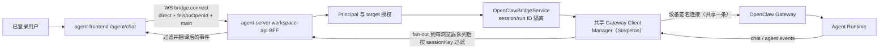
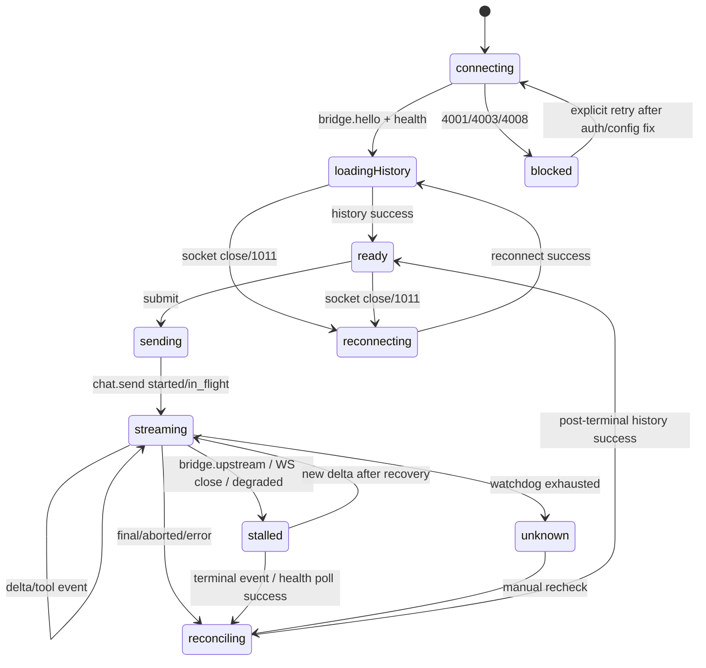

# Implementation Plan: OpenClaw Phase 1 基础连接与单会话聊天

## Overview

Phase 1 在 `agent-server` 已完成的 M0 OpenClaw BFF WebSocket 桥接上，交付一个可进入实际使用的单会话聊天页。前端只连接同源 BFF，由 BFF 继续承担身份认证、目标授权、Gateway 设备签名、内部 `sessionKey` 隔离和事件过滤。

本阶段固定使用用户自己的飞书身份作为 `direct` target，并使用语义稳定的 `clientSessionId=main`。因此同一用户刷新页面或更换浏览器后仍进入同一条聊天历史；多 Chat、群聊、文件、Subagent、Cron 和审批不进入本阶段。

WebUI 会话与飞书私聊是**两条相互独立的对话历史**：同一个专属 agent（共享 memory 与 workspace），但 transcript 互不可见，网页消息也不会投递到飞书（BFF 丢弃 `deliver`）。曾评估直接绑定飞书渠道主会话（`agent:{agentId}:main`）以共享历史，经权衡后否决，理由与详情见 `docs/adr/0002-webui-isolated-session-over-channel-main.md`。UI 必须向用户明示该隔离语义，并区分"transcript 隔离"与"memory/workspace 共享"。

### 已核实的链路拓扑（访谈修订）

上游 Gateway 连接是 **全局 Singleton 共享一条**（`agent-server/app/common/containers/clients.py:248` `providers.Singleton`）。每个浏览器 Tab 在 `bridge.connect` 后由 `gateway_manager.subscribe()` 拿到一个独立的 `asyncio.Queue(maxsize=100)`，但所有 Tab 共享同一条上游连接与同一个 fan-out 集合。这带来两个被本计划显式处理的结构性后果：

1. **事件 fan-out 在前、sessionKey 过滤在后**：每个浏览器订阅队列承受的是共享上游连接的**全部**事件量（含其他 session 最终被过滤的事件）。队列阈值是慢订阅者隔离护栏，不是容量目标（见 Architecture Decision 8）。
2. **同 session 的多 Tab 收到同一份广播**：`broadcast` 遍历所有 Gateway 连接、不做 session 成员校验（`src/gateway/server-broadcast.ts:93-114`）；BFF `filter_event` 只做 `sessionKey` 精确比较（`agent-server/app/services/openclaw_bridge_service.py`）。因此同用户多 Tab（`clientSessionId` 都固定为 `main` → 相同 `binding.session_key`）会同时收到同 session 的所有事件，**包括工具事件**。这修正了早期"foreign run 没有实时工具卡片"的断言（见 Architecture Decision 5）。

## Requirements

- 复用现有 `/api/v1/openclaw/ws`，前端不得直连 OpenClaw Gateway。
- 页面从现有登录态读取 `user.feishuOpenId`（`useAuth()` → `user?.feishuOpenId`，类型为 `string | null | undefined`），不允许用户手工输入 target ID；缺失时进入账号未绑定错误态。
- 一个用户只展示一个逻辑 Chat，固定前端会话 ID 为 `main`。
- 页面明示"此为网页专属会话，与飞书聊天记录相互独立"，并区分 memory/workspace 共享语义（见 Architecture Decision 9）。
- 支持历史加载、文本发送、流式 Markdown、终止生成、错误状态和断线恢复。
- 本 Tab 采用单飞行 run：流式期间发送按钮切换为停止按钮，不允许并发提交。
- 支持工具调用的基础实时展示：工具名、参数、运行状态、错误状态；完整工具结果不作为 Phase 1 承诺。工具事件覆盖同 session 的 own 与 foreign run（见 Architecture Decision 5）。
- **历史是内容事实源，幂等 `chat.send` ack status 是 run 存活事实源；两者分离，一次 history 不能可靠判断 run 已终态**（见 Architecture Decision 3、4）。
- 断线后不承诺事件续传；正确性一律依赖重新对账（见 Architecture Decision 3）。
- 保持 M0 的 target、session、run ID 隔离规则，不向浏览器暴露原始 Gateway `sessionKey`。
- 只运行定向测试；不运行三个仓库的全量测试。

## Scope

### Included

- 用户 direct target。
- 固定 `main` 会话（webui 隔离会话）。
- `bridge.connect`、`bridge.hello`、`bridge.upstream`（连接级断开，新增）、`health`、`chat.history`、`chat.send`、`chat.abort`。
- `chat.send` ack 的四种形态：`started` / `in_flight` / `ok` / `error`（见 Protocol Contract）。
- `chat` 事件的 `delta`、`final`、`aborted`、`error` 和 BFF 合成的 `degraded`。
- `agent` 事件中 `stream=tool` 的基础卡片（同 session 的 own 与 foreign run）；`agent` 事件的 `stream=error`/`reason:"seq gap"` 作为完整性信号（见 Architecture Decision 6）。
- 自动重连、手动重试、degraded/stalled 期间的 health 轮询恢复、空态、加载态和不可恢复错误态。
- 同会话 foreign run（其他 Tab 发起）的流式内容与工具卡片照常渲染，仅控制权隔离。
- post-ack 看门狗与幂等 `chat.send` 探测（见 Architecture Decision 7）。
- 可观测性埋点（队列水位、事件速率、1011/1008 计数、重连收敛耗时）。

### Excluded

- `sessions.list`、`sessions.preview` 和会话侧边栏。
- 群聊 target、target 切换和 Agent 切换。
- 绑定飞书渠道主会话 / 与飞书共享对话历史（已否决，见 ADR-0002）。
- 文件上传、附件、产物面板。
- thinking（思考深度）控件：composer 不暴露，`chat.send` 不传 `thinking`，UI 忽略 history 返回的 `thinkingLevel`（类型保留字段）。
- 历史分页：仅加载最近 200 条（Gateway 默认，硬上限 1000），无"加载更多"。
- Subagent 独立卡片、Cron、执行审批和配置管理。
- 完整工具输出、思维链展示和跨会话并行运行。
- 列表虚拟化（Phase 1 主要热点是单条累计 Markdown 的重复解析，列表虚拟化解决不了这一层成本）。
- fan-out 前按 sessionKey 过滤的后端重构（仅在压测显示正常负载溢出时才考虑，见 Architecture Decision 8）。

## Verified M0 Baseline

### 已具备

- `../agent-server/app/api/v1/controllers/openclaw_bridge_controller.py` 已提供认证后的 BFF WebSocket 入口（`/openclaw/ws`）、首帧 `bridge.connect`、请求转发和事件推送。close code：4001 未认证、4003 forbidden、4008 协议违规、1011 上游不可用。
- `../agent-server/app/services/openclaw_bridge_service.py` 已校验用户与 target 的归属关系，并构造 `agent:{agentId}:webchat:{clientInstanceId}:{clientSessionId}`；`filter_event` 对 `sessionKey` 做精确相等过滤；`bridge.upstream.disconnected` 在过滤前被特判，绕过 sessionKey 检查直达所有 binding。
- BFF 已只允许 `health`、`status`、`models.list`、`chat.*` 和有限的 `sessions.*` 方法，并拒绝 `config.*`、`cron.*`、`device.*`、`node.*`、`exec.approval.*`。
- BFF 已将 `frontRunId` 映射为带 target namespace 的 Gateway `idempotencyKey`（`bff-{namespace}-{frontRunId}`，namespace 为 16-hex SHA-256 摘要），并在响应和事件中翻译回前端 ID；`_front_run_id` 具备前缀剥离 fallback，映射缺失时仍能翻译。
- 上游连接重连退避 0.05s→2.0s 指数（无抖动、无上限、无限重试），由 `gateway_client_manager._reconnect_with_backoff` 承担；adapter 自身不重连，读循环失败时入队单条 `bridge.upstream.disconnected`。
- Gateway 订阅队列 `maxsize=100`，溢出时该浏览器连接收到 `GatewaySubscriberClosed` 并被以 1011 关闭；Gateway→BFF socket 的 `bufferedAmount` 超限时，`chat` delta 设 `dropIfSlow`（丢帧），而 `chat` final 与 `agent` 事件未设 → 慢消费者被 `close(1008, "slow consumer")`（`src/gateway/server-broadcast.ts:100-111`）。
- `../agent-frontend/src/utils/openclawBff/client.ts` 已实现 `bridge.connect`、请求关联、事件订阅、关闭清理和显式重连；client 不自动重连、无 request timeout、帧解析仅 `JSON.parse`+对象检查、`handleMessage` 无 try/catch（坏帧会抛未捕获异常）。
- `../agent-frontend/src/features/openclaw-bff/components/OpenClawConnectionDemo.tsx` 已验证同源代理、登录态、`bridge.hello` 和 `health` 链路（`user?.feishuOpenId` → `targetId`）。
- 前端栈：React 19 + react-router 7 + Tailwind v4（CSS-first，无 `tailwind.config.js`）+ Zustand（仅 `authStore`）+ Biome；无任何 markdown 渲染器。

### Phase 1 前必须补齐的缺口

1. `../agent-server/app/infra/openclaw/gateway_client_adapter.py` 当前以 `caps: []` 连接 Gateway（line 196，硬编码字面量，无 capability 常量）。OpenClaw 只向声明 `tool-events` capability 且发起该 run 的连接推送实时工具事件（`registerToolEventRecipient(runId, connId)`，按 runId 注册共享连接的 connId），因此工具卡片目前无法工作。已核实：开启后事件量只增加 WebUI 经 BFF 发起的 run（同 session 的其他 Tab 因 sessionKey 相同也会收到，但飞书渠道 run 的 sessionKey 不同，不会注册 BFF 连接为 recipient）。
2. `OpenClawBridgeBinding.front_to_gateway_run_ids` 和 `gateway_to_front_run_ids` 在 run 终态后没有删除（`_forget_terminal_run` 只清 `active_gateway_run_ids` 这个 set）。长连接持续聊天时映射会单调增长；degraded 合成路径同样不清理。
3. **`translate_response` / `chat.send` 异常路径不清理终态 run 的 active set**。adapter 在 `ok:false` 时直接 `raise OpenClawGatewayRequestError`（`gateway_client_adapter.py:116-123`），所以 `translate_response` 永远看不到缓存 `status:error` 终态；幂等探测重发会把已终态 run 重新加入 active set，后续断开会合成幽灵 degraded（见 Architecture Decision 7）。
4. **上游断开时，无 active own run 的 binding 收不到任何信号**。`filter_event` 对 `bridge.upstream.disconnected` 返回 `_build_degraded_run_events(binding)`，active set 为空时返回 `[]`；controller 对空 list 不发任何帧。因此 idle Tab 看不到上游断开，foreign run 会静默卡住。需新增连接级 `bridge.upstream` 事件广播给所有 binding（见 Architecture Decision 8）。
5. 前端 M0 客户端只有传输能力，没有 Chat 协议类型、历史归一化、流式 reducer、自动重连和产品页面；`frontRunId` 当前仅出现在回归测试 fixture，未接入任何生产代码。
6. BFF 合成的 `state=degraded` 不属于 OpenClaw 原生 `ChatEventSchema`，前端必须显式建模；degraded 无 seq，不参与 seq 比较。
7. 缺少可观测性：队列水位、事件速率、1011/1008 计数、重连收敛耗时均无埋点，"按数据调参"无依据。

## Architecture Decisions

### 1. 前端只连接 BFF

研究文档建议浏览器直接实现 Gateway Ed25519 认证，这一结论已被 M0 架构替代。Phase 1 的实际链路为：



浏览器不保存 Gateway token、password、设备私钥或原始 `sessionKey`。部署继续使用同源 Cookie/API 身份认证和现有 Vite WebSocket 代理（`/api/v1/openclaw/ws` 代理先于通用 `/api` 代理，`ws:true`）。

### 2. 固定 `clientSessionId=main`，绑定 webui 隔离会话（ADR-0002）

`OpenClawBridgeService` 已把 tenant、principal、target 计算成独立 namespace（16-hex SHA-256 摘要），因此 `main` 在不同用户之间不会冲突。固定 ID 比 M0 demo 的随机 localStorage ID 更符合"单会话"语义，并能跨浏览器恢复同一条历史。

注意术语：webchat 的 `main`（`agent:{id}:webchat:{clientInstanceId}:main`）与 OpenClaw 的 agent 主会话（`agent:{id}:main`，`dmScope=main` 默认时飞书私聊落于此，`src/routing/session-key.ts:127`）**同名不同物**。曾评估绑定后者以共享飞书对话，经权衡否决——飞书渠道 run 的 sessionKey 不同，工具事件 recipient 不会注册 BFF 连接；依赖部署 `dmScope` 配置；飞书 App 记录出现缺口；入站不可见。完整论证见 ADR-0002。

Phase 2 增加多 Chat 时，新会话使用独立的合法短 ID；已有 `main` 作为默认会话保留，无需迁移历史。

### 3. 断线不承诺事件续传，正确性一律依赖重新对账

区分两个事实源：

- **history：结果内容的最终事实源。**
- **幂等 `chat.send` ack status：run 是否仍在执行的事实源。**

代码事实：

- `chat` delta/final 使用全连接广播（`src/gateway/server-broadcast.ts:93-114`、`src/gateway/server-chat.ts:315,355`），新连接无需重新加入 session，因此重连后"未来的" chat 事件仍可能到达。
- 工具事件按旧 connId 定向发送（`src/gateway/server-chat.ts:439-442` `broadcastToConnIds`），新连接不会自动恢复 recipient。
- 断线期间的任何事件都不会重放；final 若落在断线窗口内，新连接永久收不到。

由此确立的合同：

- **一次 history 不能可靠判断 run 已终态**（history 可能尚未收录终态消息，或收录了但 run 仍在执行边界态）。reconcile 永远不能仅凭一次 history 就放开 composer 或清除 run 覆盖层。
- 可以消费重连后继续到达的 chat 事件改善体验，但状态机**不能依赖**它们。
- run 存活判断必须以幂等 `chat.send` ack status（`in_flight`/`ok`/`error`）为准（见 Architecture Decision 7）。
- Phase 1 真机验证仅验证"重连后事件是否恢复"的**体验**，不改变上述正确性合同。

### 4. 两层状态 + historyFence：history 只更新持久化基线

当前 `chat.history` 响应（`src/gateway/server-methods/chat.ts:591-597`）只返回 `messages`（来自 `readSessionMessages` → `stripEnvelopeFromMessages` → `sanitizeChatHistoryMessages`），**不带稳定的 per-message entry ID**；用户消息中的 message ID hint 也会被清除。因此 reducer 不能按 messageId 与本地态合并。

状态拆为两层：

```text
historyBase       最近一次持久化快照（history 返回的 messages 归一化结果）
liveRuns[runId]   覆盖层：乐观用户消息、流式 assistant 文本、工具卡片、run phase、eventIntegrity
```

`HISTORY_RECONCILED` 动作只做：

1. 丢弃序号较旧的 history 响应（每次 history 请求带单调递增的 reconcileSeq）。
2. 更新 `historyBase`。
3. **不改变任何 run 的 active/terminal 状态。**
4. 保留所有 `sending/streaming/degraded/recovering/stalled` 的 own 与 foreign `liveRuns`。
5. 只清理"在本次 history 请求发出前，已经由 ack status 或 terminal event 确认终态"的覆盖层。

为避免 history 已收录在途用户消息后与乐观消息重复，引入 **historyFence**：

- run 开始时记录当时的 history 尾部位置（fence）。
- run 在途期间，不提交 fence 之后无法归属到本 run 的 history 尾部。
- run 确认终态并完成一次"终态之后的 history 对账"后，释放 fence，原子替换完整 history，并删除该 run 覆盖层。

终态判定只由 ack status 或 terminal event 决定，history 不参与终态判定。

**乐观消息 ↔ history 的匹配谓词**（historyFence 的核心）：history 不带稳定 per-message entry ID，匹配规则为——historyFence 界定"本 run 开始时的 history 尾部"，仅在 fence 之后新增的 history 条目中，按 `(role==="user" && text≈相等 && 邻接位置)` 启发式命中本 run 的乐观用户消息；text 比较需容忍 gateway 的 `stripEnvelope`/`stripInboundMetadata`/attachment 解析对正文的改写（按 trim+去空白+去已知 envelope 前缀后做包含/相等判断）。若运行时发现 history 用户消息带顶层 `idempotencyKey`/`sid`，则作为强匹配信号优先使用、启发式退为兜底。

> **待真机确认（Open Verification）**：`readSessionMessages`（`session-utils.fs.ts:89-92`）返回 `parsed.message` 整个对象、`stripEnvelopeFromMessage` 只改 content/text 保留顶层字段，故"用户消息是否带顶层 `idempotencyKey`"决定能否把启发式升级为精确匹配。当前源码追到 `@mariozechner/pi-coding-agent`（Pi SDK，本 worktree 无源码/样本）+ reply pipeline 未定论；且 `transcriptHasIdempotencyKey`（`chat.ts:377`）的 dedup 在 assistant 注入侧检查 client idempotencyKey，暗示 client idempotencyKey 可能只挂在注入的 assistant 消息、不在用户消息上。**定论方式**：本地 Gateway 发一条 chat.send，读 sessionFile 的 `role:"user"` JSONL 行，看有无顶层 `idempotencyKey`/`sid`。结论只影响"精确 vs 启发式"，不影响两层状态骨架。

### 5. 同 session foreign run 渲染工具卡片，聚合键为 runId + toolCallId

修订早期"foreign run 没有实时工具卡片"的断言：共享上游连接下，同用户多 Tab 的 `binding.session_key` 相同，BFF `filter_event` 对工具事件（携带 sessionKey）的精确比较两 Tab 都通过 → **Tab A 发起的 run，其工具事件会同时到达 Tab A 和 Tab B**。因此 reducer 对 own 与 foreign run 走同一条工具卡片渲染路径，仅 composer 控制权字段 `activeOwnRunId` 区分。

**聚合键必须是 `runId + toolCallId`，不能只用 `toolCallId`**：OpenClaw 内部 `buildToolStartKey(runId, n) = ${runId}:${n}`（`src/agents/pi-embedded-subscribe.handlers.tools.ts`），且测试覆盖不同 run 复用相同 toolCallId 的场景。只用 toolCallId 会跨 run 错误合并。

工具事件状态机（按 `runId + toolCallId` 聚合）：

```text
phase=start  -> 创建 running 卡片，保存 name/args
phase=update -> 只更新时间；Phase 1 不渲染高频 partialResult
phase=result -> 标记 success/error，展示 meta；结果存在时截断后展示
chat terminal -> 保留本轮卡片，并用 history 对账消息
```

OpenClaw 在非 full verbose 下会去除 `result`/`partialResult`（`src/gateway/server-chat.ts:408-419`）。UI 不把"缺少 result"当作失败。飞书渠道 run 的 sessionKey 不同，其工具事件不会进入 BFF 连接的 recipient，网页对其无实时工具卡片（其工具轨迹在 history 对账后以 `toolcall`/`toolresult` block 呈现）。

### 6. seq gap 作为完整性信号（粘性脏标记）

Gateway 在 agent 事件 seq 不连续时，向 session 内所有连接广播 `agent`/`stream=error`/`data.reason:"seq gap"`（`src/gateway/server-chat.ts:420-431`），BFF 会透传到浏览器。这是 agent 事件层（含工具事件）的丢帧信号，不是 chat seq；该事件不含 `toolCallId`，丢失事件可能属于 assistant、tool 或 lifecycle，因此不能归因到某张工具卡片。

reducer 收到 `stream=error` + `reason="seq gap"`：

- 标记 `liveRuns[runId].eventIntegrity = "gap"`。
- 标记 `requiresPostTerminalReconcile = true`。
- 请求一次 300ms debounce 的 history 对账。
- 不结束 run、不修改 `activeOwnRunId`、不把 running 工具卡片标为失败、不渲染普通错误消息。

即时 history 只更新 `historyBase`，保留所有在途覆盖层；由于 run 可能仍在执行，该次对账**不能清除脏标记**。脏标记仅在以下两个条件都满足后清除：(1) ack status 或 terminal event 已确认 run 终态；(2) 随后发起的 history 请求成功返回。即必须保证一次"终态之后的对账"，不能被终态之前的即时对账替代。其他未知 `agent` stream 继续忽略。

### 7. post-ack 看门狗 + 幂等 chat.send 探测

幂等缓存（`DEDUPE_TTL_MS = 5 * 60_000`，`src/gateway/server-constants.ts:35`）只重放 ack、不重放事件。`chat.send` 重发按 idempotencyKey 返回四种 ack（`src/gateway/server-methods/chat.ts:773-803,961-978`，`docs/web/control-ui.md:91-95`）：

- 首次发送 → `{status:"started"}`。
- 运行中重发 → `{status:"in_flight"}`（`chatAbortControllers` 命中，line 781-788）。
- 终态成功重发 → `{status:"ok"}`（dedupe 缓存，line 961-965）。
- 终态失败重发 → `{status:"error"}`（dedupe 缓存，line 969-978）。

**主收敛链路**（reducer 只接收"看门狗触发对账"与"history 对账完成"动作，定时器全部在 `useOpenClawChat`，reducer 保持纯函数）：

| ack                                 | 处理                                                                                                                 |
| ----------------------------------- | -------------------------------------------------------------------------------------------------------------------- |
| `ok`                                | 明确终态成功；立即触发 post-terminal history 对账并结束本地 run。                                                    |
| `error`                             | 明确终态失败；显示错误 + history 对账并结束本地 run。                                                                |
| `started` / `in_flight`             | 启动 8s 首事件看门狗。                                                                                               |
| 收到同 runId 的任意 chat/agent 事件 | 取消看门狗。                                                                                                         |
| 看门狗到期                          | 用**原始参数**（相同 frontRunId + message + session）重发 `chat.send`，只读 ack status，**不创建新的本地乐观消息**。 |

**探测结果处理**：

| 探测 ack                       | 处理                                                                                   |
| ------------------------------ | -------------------------------------------------------------------------------------- |
| `in_flight`                    | 明确仍存活；保持 composer 锁定，重置看门狗（不消耗模糊失败次数，但受总时间窗口约束）。 |
| `ok`                           | 明确终态；立即触发 post-terminal history 对账。                                        |
| `error` / Gateway 明确错误响应 | 视为拒绝或终态 error；触发 history，结束该 run。                                       |
| `started`                      | 视为运行中（探测时出现说明 Gateway 未命中 dedupe，记录异常；该 run 已被启动）。        |
| 请求超时 / 连接中断            | 状态未知；按 8s/16s/32s 最多重试 3 次。                                                |
| 超过探测窗口或连续模糊失败耗尽 | 进入 `unknown/stalled`，停止自动重发，保持 composer 禁用，提供"重新检查"与"停止运行"。 |

**安全窗口**：自动探测必须限制在首次发送后的安全窗口内（4 分钟），避免越过 Gateway 5 分钟 dedupe TTL 后启动重复 run。dedupe TTL 从**终态时刻**起算、安全窗口从**首次发送**起算，故 run 近乎瞬时完成时余量最紧（约 60s）；后台 Tab 的 timer throttling 会吃掉余量，故窗口取 4min（非 4m30s）并配合 visibility 回前台立即收敛（见 Architecture Decision 11）。

**重连期 sending（ack 未到达 WS 就断）**：watchdog 覆盖"ack 超时"，但 WS 在 `sending` 态关闭时 ack 可能从未到达——send 可能丢了也可能到了。重连恢复路径上，对仍处 `sending` 的 own run 复用同一套幂等探测（同 frontRunId + message 重发读 ack），不另起乐观消息、不生成新 run ID。状态流程需补 `sending → reconnecting` 边，重连成功后由探测结果（`started/in_flight/ok/error`）决定收敛，而非直接 loadingHistory（避免 send 丢失时乐观消息永久悬挂）。

**BFF 必须修正（解决幽灵 degraded）**：当前 `_rewrite_chat_send_params()` 每次都把 run 加回 active set，即使该 run 已终态。修正规则：

- `translate_response()` 收到 `started`/`in_flight`：保留 active。
- 收到 `ok`：同步清理 active set 与双向映射。
- `chat.send` 收到明确 Gateway error：同步清理。
- `GATEWAY_REQUEST_TIMEOUT` 或连接异常：结果不确定，保留 active。

由于 adapter 在 `ok:false` 时直接抛 `OpenClawGatewayRequestError`（`gateway_client_adapter.py:116-123`），`translate_response()` 看不到 `status=error`，因此 **error 终态的清理必须放在 controller/service 的异常回收路径，或让 adapter 保留 Gateway terminal payload**；只改 `translate_response()` 不完整。

### 8. 队列阈值是慢订阅者护栏 + bridge.upstream 连接级事件 + stalled 态

**100 是护栏，不是容量目标**。每个 `maxsize=100` 队列承受共享上游连接的全部事件量（fan-out 在前、sessionKey 过滤在后）。扩大队列只会延迟断线并增加内存与事件拖尾。Phase 1 处理：

- 把 `100` 提取为命名常量，保持现值。
- 队列溢出继续关闭单个浏览器连接（1011），由重连和 history 对账收敛。
- 前端对 Markdown 渲染、tool update reducer 更新做批处理或节流（见 Architecture Decision 10）。
- 若压测发现正常并发也溢出，处理顺序：(1) 合并或丢弃可恢复的 `tool phase=update`；(2) 在进入订阅队列前按 sessionKey 过滤（后端重构）；(3) 最后才根据突发水位调整队列大小。终态、`tool start/result` 和 seq-gap 信号不能作为可丢事件。

**新增 `bridge.upstream` 连接级事件**（解决 foreign run 静默卡住）：上游断开时，BFF 向每个 browser binding 发送不带 `runId` 的连接级事件，表示整条共享上游连接失效：

```json
{ "event": "bridge.upstream", "payload": { "state": "disconnected", "reason": "closed" } }
```

现有 own run 的 `chat/degraded` 保留，前端按幂等方式处理。前端收到以下任一信号时统一执行 `UPSTREAM_DISCONNECTED`：`bridge.upstream/disconnected`、浏览器 WebSocket close、own run 的 `chat/degraded`。reducer 行为：

- 将所有 `sending/streaming` 的 live run（含 own 与 foreign）改为 `stalled`。
- 保留已有 partial、工具卡片和乐观消息；`stalled` 不是终态。
- 禁用 own composer 控制权。
- 启动 health 轮询并触发 history 对账。

恢复后：history 只更新 `historyBase`；新 delta 到达 → `stalled → streaming`；terminal event 到达 → 正常终态收敛；final 落在断线窗口 → 通过后续 history 恢复内容，不期待事件重放。foreign 流式超时可作为额外防线，但不替代连接级事件（长工具调用可能合法地长时间无 delta，固定超时易误判）。后端测试必须覆盖"binding 没有 active own run 时仍收到连接级断开事件"——这是当前缺口的核心断言。

### 9. 隔离语义：空态提示 + 首次进入 banner

Banner（首次进入即展示，历史非空也展示）：

> **网页与飞书的聊天记录相互独立**
> 这里不会显示飞书聊天记录。网页和飞书使用同一个 Agent 的记忆与工作区，因此它可能引用已在另一端写入记忆或工作区的信息。

空态：

> 这是网页专属会话，不显示飞书聊天记录。

文案避免写成"Agent 记得飞书里的所有内容"——共享 memory/workspace 不等于能够读取完整飞书 transcript。

行为约束：用户点击"知道了"后关闭；localStorage key 版本化并按当前用户隔离，例如 `openclaw-chat-context-notice:v1:<userId>`（**不使用 `feishuOpenId`** 作为存储 key）；localStorage 不可用时正常展示，不影响聊天功能；文案语义变更时升级版本使用户重新确认。

### 10. 流式 Markdown：delta 合并节流 + 超长折叠停止解析

**Delta 合并**（在 `useOpenClawChat`，按 `runId` 缓冲最新累计快照）：

- `DELTA_COALESCE_MS = 250`（250ms 最多 dispatch 一次）；窗口内只保留最高 `seq` 的完整文本。
- own/foreign run 分别缓冲。
- `final/error/aborted/degraded` 立即直通，并取消该 run 待执行的 delta。
- reducer 纯函数，不持有 timer。

**Markdown 渲染**：

- 低于 `STREAMDOWN_MAX_CHARS = 12_000` 字符：使用 Streamdown。
- 流式超过阈值：停止挂载 Streamdown（**折叠必须同时停止 Markdown 解析，仅用 CSS 隐藏完整 DOM 无法减压**），显示折叠占位与有限长度的纯文本尾部预览。
- 终态超过阈值：默认折叠；用户展开时才执行一次完整 Markdown 解析。
- 代码高亮优先在代码围栏闭合或 run 终态后启用，避免每个 partial 重复高亮。
- raw HTML 始终禁用。

`DELTA_COALESCE_MS`、`STREAMDOWN_MAX_CHARS` 提取为命名常量，后续按真机数据调整。依赖：`streamdown` + `@streamdown/cjk`（中文流式断词）+ `@streamdown/code`（代码高亮，streamdown 2.x 已拆分为插件）；需把 streamdown dist 加入 Tailwind source。不装 math/mermaid，不引入 CodeMirror 或面板布局依赖。

**工具参数/结果截断 + URI sanitize**：工具参数与结果可能含大段文件内容或不可信 URL。`ToolCallCard` 对 args 设上限（建议 `TOOL_ARGS_MAX_CHARS = 4_000`）、result 设上限（`TOOL_RESULT_MAX_CHARS = 2_000`），超长截断并标注；args 以转义后的 JSON 文本渲染。Markdown 链接 sanitize 白名单 `http/https/mailto`，剥离 `javascript:`/`data:` 等危险 scheme（streamdown 默认禁 raw HTML，但链接 scheme 需显式配置）。两个阈值提取为命名常量。

### 11. Page Visibility 与后台 Tab 的 timer 收敛

浏览器把后台 Tab 的 timer 节流到最低（`setTimeout` 最小 ~1s、长任务可能暂停）。watchdog(8s)、delta 合并(250ms)、health 轮询(5s)、幂等探测(8/16/32s) 在后台时都会偏离。后果：后台 Tab 的 watchdog 可能晚触发数秒、delta 合并积压、health 轮询变慢。Tab 回前台时状态可能已陈旧（仍显 stalled、或消息列表落后）。

处理：`useOpenClawChat` 监听 `visibilitychange`，在 `document.visibilityState === "visible"` 时触发一次 `health` + history 对账收敛（不重启连接）；并补跑任何该跑的探测（如 still-`sending`/`streaming` 的 run 走幂等探测读 ack status）。这与 watchdog 的 4min 安全窗口配合：后台 throttling 吃掉的余量由"回前台立即收敛"兜底。reducer 不感知 visibility，纯由 hook 在 visible 时 dispatch 对应 action。

## Protocol Contract

### Connect

```json
{
  "type": "req",
  "id": "req_1",
  "method": "bridge.connect",
  "params": {
    "targetKind": "direct",
    "targetId": "<current-user-feishu-open-id>",
    "clientSessionId": "main",
    "clientInstanceId": "client_<random-id>"
  }
}
```

`OpenClawBffClient` 在实例创建时生成 `clientInstanceId`，同一页面内 WebSocket 重连复用该值；页面卸载后不保留。BFF 仅保存其 16-hex 哈希，用于把 run idempotency scope 隔离到当前浏览器实例。

收到 `bridge.hello` 后检查 `clientSessionId`、target 和 `methods`，再请求 `health` 与 `chat.history`。缺少 `chat.send`、`chat.history` 或 `chat.abort` 时进入协议不兼容错误态。

### bridge.upstream（连接级，BFF 新增）

```json
{
  "type": "event",
  "event": "bridge.upstream",
  "payload": { "state": "disconnected", "reason": "closed" }
}
```

不带 `runId`，表示整条共享上游连接失效。BFF 在收到 `bridge.upstream.disconnected` 时向所有 binding 广播（即使该 binding 无 active own run）。

### History

```json
{
  "method": "chat.history",
  "params": { "sessionKey": "main", "limit": 200 }
}
```

BFF 把 `main` 重写成内部 session key。响应含 `messages`、`thinkingLevel`、`verboseLevel`、`sessionId`、`sessionKey`；前端只消费 `messages`，忽略其余字段（类型保留）。**响应不带稳定的 per-message entry ID**，reducer 不能按 id 合并。单条超大消息会被 Gateway 替换为占位文本 `[chat.history omitted: message too large]`，mapper 按此识别并降级为 system notice。Phase 1 不做分页，仅展示最近 200 条。每次 history 请求带单调递增的 `reconcileSeq`，reducer 丢弃序号较旧的响应。

### Send

```json
{
  "method": "chat.send",
  "params": {
    "frontRunId": "run_<uuid-without-dashes>",
    "message": "用户输入"
  }
}
```

`frontRunId` 必须满足 `^[a-z0-9][a-z0-9_-]{0,47}$`。BFF 注入内部 `sessionKey` 和 `idempotencyKey`（`bff-{targetNamespace}-{clientInstanceHash}-{frontRunId}`）；不传 `thinking`；不转发 `deliver`（网页消息不投递飞书）。相同页面实例重连后可重建同一 idempotency key，不同 Tab 即使看到相同 `frontRunId` 也会映射到不同 key。ack 有四种形态：

| 场景                            | ack                                   |
| ------------------------------- | ------------------------------------- |
| 首次发送                        | `{ runId, status: "started" }`        |
| 运行中重发（同 idempotencyKey） | `{ runId, status: "in_flight" }`      |
| 终态成功后重发                  | `{ runId, status: "ok" }`             |
| 终态失败后重发                  | `{ runId, status: "error", summary }` |

ack 中的 `runId` 已被 BFF 翻译回前端 frontRunId。重发不创建新 run，命中 Gateway 幂等缓存。

### Abort

```json
{
  "method": "chat.abort",
  "params": { "runId": "run_<uuid-without-dashes>" }
}
```

前端发送 frontRunId，BFF `_gateway_run_id` 按当前 binding 的 target namespace 与 client-instance hash 重建内部 runId。前端只允许终止本 Tab 当前已确认的 run。终止按钮进入 pending，直到收到 `aborted` 事件，或 abort 响应返回 `{ ok: true, aborted: false, runIds: [] }`（run 已结束，非错误）——此时清除 pending 并触发 history 对账。

**BFF 必须强制 runId + 拒绝 session 作用域 abort（跨 Tab 隔离）**：OpenClaw `chat.abort` 支持 `{sessionKey}`（不传 runId）中止该 session 所有 active run（`docs/web/control-ui.md`）。若 BFF 透传，浏览器发 `chat.abort {sessionKey:"main"}` 会中止同 session 内**其他 Tab** 的 run。BFF rewrite 必须要求 `runId`，并只按当前 binding 的 client-instance hash 构造 Gateway runId；同 session 的其他 Tab 使用不同 hash，无法命中该 run。该能力在 ack 超时和 WebSocket 重连后仍成立，不依赖一次性 binding map。

### Event states

| Event             | State/stream                  | Frontend action                                                                                       |
| ----------------- | ----------------------------- | ----------------------------------------------------------------------------------------------------- |
| `chat`            | `delta`                       | 按 runId 缓冲，250ms 合并最高 seq 后替换累计流式文本（含 foreign run）                                |
| `chat`            | `final`                       | 清除运行态，显示 final，并触发 post-terminal history 对账                                             |
| `chat`            | `aborted`                     | 保留可用 partial，标记已终止，并重载历史                                                              |
| `chat`            | `error`                       | 显示可重试错误，并重载历史                                                                            |
| `chat`            | `degraded`                    | 标记上游断开（own run），本轮结果未知；触发 `UPSTREAM_DISCONNECTED` 路径                              |
| `bridge.upstream` | `disconnected`                | 触发 `UPSTREAM_DISCONNECTED`：所有 streaming run（含 foreign）改 stalled                              |
| `agent`           | `tool`                        | 以 `runId + toolCallId` 聚合工具卡片（同 session own 与 foreign 都会收到）                            |
| `agent`           | `error`（`reason:"seq gap"`） | 标记 `eventIntegrity="gap"` + `requiresPostTerminalReconcile`，触发 300ms debounce 对账；不当工具失败 |

## State Flow



连接状态、run 状态与 watchdog 状态分开建模。BFF socket 仍在线但 Gateway 上游断开时，连接状态可为 `connected`，当前 run 状态为 `stalled`；三者不能合并成一个布尔值。

- **`stalled`**：上游断开（`bridge.upstream` / WS close / own run degraded）触发；所有 streaming live run（含 foreign）进入 stalled，保留 partial/工具/乐观消息，禁用 own composer，启动 health 轮询。stalled 不是终态。
- **`unknown`**：post-ack 看门狗超过安全窗口或连续模糊失败耗尽；停止自动重发，保持 composer 禁用，提供"重新检查"与"停止运行"。
- **degraded/health 恢复探测**：BFF 在上游恢复后不推送信号，前端每 5s 发一次 `health`（失败逐步放宽至 30s），成功即重载 history 并据新事件恢复；手动重试立即触发一次探测。期间 composer 禁用发送（`chat.send` 会返回 `GATEWAY_UPSTREAM_UNAVAILABLE`）。
- **WebSocket 重连退避**：可恢复关闭从 1s 起指数退避（×2，上限 30s，±20% 抖动）；4001/4003/4008 停止自动重连进入 blocked，其中 4001 引导重新登录。
- **post-ack 看门狗**：8s 首事件；到期用幂等 `chat.send` 探测，超时按 8s/16s/32s 最多 3 次；总安全窗口 4 分钟（不越过 5min dedupe TTL）。

## Architecture Changes

### agent-server

- `../agent-server/app/common/constants/openclaw_gateway.py`
  - 增加 Gateway capability 常量（如 `OPENCLAW_GATEWAY_CAP_TOOL_EVENTS = "tool-events"`），避免 magic string。
  - 增加连接级事件常量（如 `BRIDGE_UPSTREAM_EVENT = "bridge.upstream"`、`BRIDGE_UPSTREAM_STATE_DISCONNECTED = "disconnected"`）。
- `../agent-server/app/infra/openclaw/gateway_client_adapter.py`
  - connect payload 声明 `tool-events` capability（从常量取值），保持 scopes 为 `operator.read/operator.write`，使该共享连接发起的 Chat run 能收到工具事件。
- `../agent-server/app/services/openclaw_bridge_service.py`
  - run 进入 `final/error/aborted/cancelled` 后，同时清理 active set 和双向 run 映射；`_build_degraded_run_events` 合成 degraded 时同样清理双向映射。上游恢复后迟到的终态事件靠 `_front_run_id` 前缀剥离 fallback 仍可翻译。
  - **`chat.send` 终态 ack 清理**：`translate_response()` 收到 `ok` 时清理 active set 与双向映射；收到 `started/in_flight` 保留。因 adapter 对 `ok:false` 抛异常，error 终态清理放在 controller/service 的 `OpenClawGatewayRequestError` 回收路径（或让 adapter 保留 terminal payload）。`GATEWAY_REQUEST_TIMEOUT`/连接异常保留 active。
  - **`chat.abort` 强制 runId + client-instance 隔离**：`bridge.connect` 要求随机 `clientInstanceId`，BFF 把其 hash 纳入 Gateway runId；rewrite 拒绝无 `runId` 的 session 作用域 abort，并只重建当前 client instance 的 runId。相同 Tab 重连保持所有权，不同 Tab 无法命中。
  - **新增 `bridge.upstream` 连接级事件**：manager 把 `bridge.upstream.disconnected` fan-out 到**每个**订阅队列，每个 Tab 自己的 `_forward_gateway_events` 各自调 `filter_event`，故在 `filter_event` 内为**当前 binding** 合成一条 `bridge.upstream/disconnected`（无 runId）——**不需要** service 层遍历所有 binding。除连接级事件外，有 active own run 的 binding 额外合成 `chat/degraded`。结果：所有 Tab（含无 active own run 的 idle Tab）都收到连接级断开信号。保持现有 sessionKey 精确过滤，不扩大事件可见范围。
- `../agent-server/app/infra/openclaw/gateway_client_manager.py`
  - 把订阅队列 `maxsize=100` 提取为命名常量（如 `SUBSCRIBER_QUEUE_MAXSIZE = 100`），保持现值。
  - 增加可观测性：订阅队列最高水位、agent/tool 各 phase 事件速率、`GatewaySubscriberClosed`（1011）次数、重连后 history 收敛耗时。
- `../agent-server/app/test/unit_test/infra/openclaw/test_gateway_client_adapter.py`
  - 断言 connect capability 包含 `tool-events`。
- `../agent-server/app/test/unit_test/services/test_openclaw_bridge_service.py`
  - 覆盖 agent tool 事件过滤/翻译、跨 session 丢弃、终态映射清理、degraded 路径映射清理。
  - **新增**：`bridge.upstream.disconnected` 时，无 active own run 的 binding 也收到 `bridge.upstream` 连接级事件。
  - **新增**：`chat.send` ack `ok` 后 active set 与双向映射被清理；`GATEWAY_REQUEST_TIMEOUT` 后保留 active；terminal 探测后再次断线不生成幽灵 degraded。
- `../agent-server/app/test/unit_test/api/test_openclaw_bridge_controller.py`
  - 覆盖授权浏览器收到翻译后的 `agent` tool event 与 `bridge.upstream` 连接级事件。
- `../agent-server/docs/runbooks/openclaw-bff-gateway-operations.md`
  - 记录 tool event capability 只增加 WebUI 经 BFF 发起的 run 的事件量（同 session 多 Tab 因 sessionKey 相同都会收到，飞书渠道 run 不注册 BFF 为 recipient）；订阅队列（maxsize=100）溢出时浏览器连接被关闭并重连；1008（gateway 慢消费者）与 1011（BFF 队列溢出）的区别；可观测性指标含义。

### agent-frontend transport and state

- `../agent-frontend/src/utils/openclawBff/types.ts`
  - 增加 Chat ack（`started/in_flight/ok/error`）、history、chat event、agent event（tool + seq-gap error）、`bridge.upstream` event 的精确类型；包含 BFF `degraded` 扩展态；对未知字段保持兼容。
- `../agent-frontend/src/utils/openclawBff/client.ts`
  - 保留通用 req/res/event 职责。
  - 增加可配置 request timeout 与无效服务端帧的受控错误处理（`handleMessage` 包 try/catch，坏帧不再抛未捕获异常），关闭时清理 timer。
  - 不把 Chat reducer 或 React 状态塞进 transport class。
- `../agent-frontend/src/features/openclaw-bff/types/chat.ts`
  - 定义稳定的消息、工具卡片、连接、run view model；包含 `historyBase`、`liveRuns[runId]`（含 `phase`、`eventIntegrity`、`requiresPostTerminalReconcile`）、`historyFence` 形状。
- `../agent-frontend/src/features/openclaw-bff/api/chat-mappers.ts`
  - 将 OpenClaw history 中的 `string`、content blocks、`text`、`toolcall`、`toolresult` 归一化。
  - 识别 oversized 占位文本并降级为 system notice；对未知 block 采取忽略并保留原消息的策略。**不假设 history 带稳定 messageId。**
- `../agent-frontend/src/features/openclaw-bff/state/chat-reducer.ts`（纯函数）
  - 两层状态：`historyBase` + `liveRuns[runId]`。
  - `HISTORY_RECONCILED`：丢弃旧 reconcileSeq、更新 historyBase、不改任何 run 终态、保留在途覆盖层、只清理请求发出前已确认终态的覆盖层。
  - 处理乐观消息、累计 delta（own 与 foreign 同一路径，按 `runId + toolCallId` 聚合工具）、seq-gap 粘性脏标记、`activeOwnRunId` 控制权字段、`stalled`/`unknown` 与全部终态。
  - reducer 不持有 timer；只接收"看门狗触发对账"与"history 对账完成"等动作。
- `../agent-frontend/src/features/openclaw-bff/hooks/useOpenClawChat.ts`
  - 拥有单个 client、订阅、重连 timer、degraded health 轮询、history 对账（300ms debounce，带 reconcileSeq）、send/abort 命令。
  - **post-ack 看门狗**（8s 首事件 + 幂等 `chat.send` 探测，8s/16s/32s 最多 3 次，4m30s 安全窗口）。
  - **delta 合并**（`DELTA_COALESCE_MS=250`，按 runId 缓冲最高 seq，终态直通并取消 pending delta）。
  - 使用 `user.feishuOpenId` 和固定 `main`，不保留 demo 的 target 输入框与随机 localStorage session ID。
  - effect cleanup 防止旧 client 回调覆盖新连接状态，并取消所有 timer。

### agent-frontend UI and route

- `../agent-frontend/src/features/openclaw-bff/components/chat/ChatConnectionNotice.tsx`
  - 展示连接中、重连中、degraded/stalled（含轮询中提示）、unknown（提供"重新检查"/"停止运行"）、鉴权失败（4001 引导重新登录）和重试入口。
- `../agent-frontend/src/features/openclaw-bff/components/chat/ChatMessageList.tsx`
  - 管理空态、自动滚动和"用户上滚后不强制抢焦点"的行为。
- `../agent-frontend/src/features/openclaw-bff/components/chat/ChatMessageItem.tsx`
  - 渲染 user/assistant/system 消息；Markdown 禁止 raw HTML；超过 `STREAMDOWN_MAX_CHARS` 折叠（折叠时停止挂载 Streamdown，展开才一次性解析）。
- `../agent-frontend/src/features/openclaw-bff/components/chat/ToolCallCard.tsx`
  - 折叠显示 name、args、状态、耗时和截断结果。
- `../agent-frontend/src/features/openclaw-bff/components/chat/ChatComposer.tsx`
  - 文本输入、Enter 发送、Shift+Enter 换行；单飞行：active run 期间发送按钮切换为停止按钮，禁用提交并显示原因（生成中 / degraded 恢复中 / stalled / 未连接）。
- `../agent-frontend/src/features/openclaw-bff/components/chat/IsolationNotice.tsx`（新增）
  - 首次进入 banner（历史非空也展示），文案区分 transcript 隔离与 memory/workspace 共享；点击"知道了"关闭，localStorage key `openclaw-chat-context-notice:v1:<userId>`（不用 feishuOpenId），版本化；存储异常降级为正常展示。
- `../agent-frontend/src/features/openclaw-bff/screen/OpenClawChatScreen.tsx`
  - 组合 AppShell、IsolationNotice、状态 notice、消息列表和 composer，不直接操作 WebSocket。
- `../agent-frontend/src/pages/OpenClawChatPage.tsx`
  - 保持薄路由适配器。
- `../agent-frontend/src/app/router/AppRouter.tsx`
  - 新增受保护路由 `/agent/chat`。
- `../agent-frontend/src/features/dashboard/screen/DashboardScreen.tsx`
  - 增加聊天入口（AgentCard 或 Coming Next 卡，`linkTo="/agent/chat"`）。
- `../agent-frontend/package.json`
  - 流式 Markdown 依赖：`streamdown` + `@streamdown/cjk` + `@streamdown/code`（对齐同栈参考项目 aipoch-open-science）；需把 streamdown dist 加入 Tailwind source。不在 Phase 1 引入 CodeMirror、面板布局依赖或列表虚拟化。
- 可观测性埋点（前端）：上报 delta 合并丢弃数、streamdown 折叠触发次数、watchdog 探测结果分布、重连/history 收敛耗时，与后端指标对齐。

M0 的 `/agent/openclaw-ws-demo` 在 Phase 1 验收前保留作为诊断入口；产品路由验证稳定后再单独删除，不在同一改动中混合清理。

## Implementation Steps

### Phase 1A: 固化 BFF 事件合同

1. **启用工具事件 capability**（`constants/openclaw_gateway.py`、`gateway_client_adapter.py`）。保持 scopes。Complexity/Risk：低。已核实事件量只增加同 session 的 BFF 发起 run（含多 Tab）。
2. **清理终态与 degraded 的 run 映射**（`openclaw_bridge_service.py`）。翻译完终态事件后删除双向映射与 active 记录；degraded 路径同样清理。必须先翻译 runId 再清理。
3. **`chat.send` 终态 ack 清理 active set**（`openclaw_bridge_service.py` / controller 异常路径）。`ok` 清理，`started/in_flight` 保留，error 经异常回收路径清理，timeout/连接异常保留。解决幂等探测的幽灵 degraded。
4. **新增 `bridge.upstream` 连接级广播**（`openclaw_bridge_service.py`）。上游断开时向所有 binding 发送无 runId 的连接级事件；保留现有 own run degraded 合成。Complexity：中；Risk：中（必须保证无 active own run 的 binding 也收到）。
5. **提取队列常量 + 可观测性**（`gateway_client_manager.py`）。`SUBSCRIBER_QUEUE_MAXSIZE=100` 命名常量；埋点队列水位、事件速率、1011 次数、重连收敛耗时。
6. **补齐 BFF 合同测试和运维说明**（上述 backend test 与 runbook）。证明 tool event 只到同一 session（含多 Tab）、跨 target/session 丢弃、`bridge.upstream` 无 active run 也送达、ack `ok` 后 active 清理、degraded/terminal 后映射清空。

### Phase 1B: 建立前端领域类型与两层 reducer

7. **定义协议 DTO 与运行时守卫**（`utils/openclawBff/types.ts`）。建模 hello、history、send ack 四态、abort 响应、chat/agent/bridge.upstream event；对未知字段兼容。
8. **实现历史归一化与安全文本提取**（`api/chat-mappers.ts`）。按执行顺序支持 `content:string`、文本 block、toolcall/toolresult、`text` fallback；识别 oversized 占位；不假设稳定 messageId。
9. **实现两层纯 reducer**（`state/chat-reducer.ts`）。`historyBase` + `liveRuns[runId]`；`HISTORY_RECONCILED` 只更新基线、保留在途覆盖层；工具按 `runId+toolCallId` 聚合；seq-gap 粘性脏标记；`activeOwnRunId` 控制权；`stalled`/`unknown` 与全部终态；historyFence 防重复。Complexity：高。

### Phase 1C: 连接生命周期、看门狗与命令编排

10. **加固通用 BFF client**（`utils/openclawBff/client.ts`）。request timeout、坏帧受控处理（try/catch）、timer 清理；不破坏 M0 pending request 与 listener 语义。
11. **实现 `useOpenClawChat`**（`hooks/useOpenClawChat.ts`）。connect → hello 校验 → health → history；注册 chat/agent/bridge.upstream/close 订阅；提供 send/abort/retry；history 对账 300ms debounce 带 reconcileSeq；effect cleanup 取消旧回调与 timer。
12. **实现重连、degraded/stalled 轮询、对账与看门狗策略**（同上）。可恢复关闭 1s 起 ×2 上限 30s ±20% 抖动；4001/4003/4008 停止自动重连（4001 引导重新登录）；`UPSTREAM_DISCONNECTED` 统一入口（bridge.upstream/WS close/degraded）；delta 合并 `DELTA_COALESCE_MS=250`；post-ack 看门狗（8s + 幂等探测 8/16/32s ×3，4min 窗口）；stalled 期间 5s→30s health 轮询。

### Phase 1D: 产品聊天页

13. **实现聊天组件**（`components/chat/*`）。消息、工具卡片、单飞行 composer、连接 notice（含隔离提示、degraded/stalled/unknown 提示）、滚动行为、streamdown（< `STREAMDOWN_MAX_CHARS` 渲染、超长折叠停止解析、展开才解析、代码围栏闭合/终态后高亮、禁 raw HTML）。
14. **实现 IsolationNotice**（`components/chat/IsolationNotice.tsx`）。首次进入 banner（历史非空也展示），版本化 + 按 userId 隔离的 localStorage，存储异常降级。
15. **新增产品路由与入口**（`OpenClawChatScreen.tsx`、`OpenClawChatPage.tsx`、`AppRouter.tsx`、`DashboardScreen.tsx`）。新增 `/agent/chat`，使用现有 ProtectedRoute 与 AppShell。
16. **端到端冒烟与回归**。真实用户登录态发送会触发工具调用的消息，验证刷新恢复、流式、工具卡片（own + foreign）、终止、双 Tab foreign 渲染、断线 stalled 恢复、watchdog 探测。

## Testing Strategy

### agent-server unit tests

```bash
uv run pytest \
  app/test/unit_test/infra/openclaw/test_gateway_client_adapter.py \
  app/test/unit_test/services/test_openclaw_bridge_service.py \
  app/test/unit_test/api/test_openclaw_bridge_controller.py
```

重点断言：

- connect payload 包含 `tool-events`。
- 同 session 的 tool event 被翻译并转发（含多 Tab 同 session）。
- 其他 target/session 的 tool event 被丢弃。
- terminal chat event 后 run 双向映射与 active set 被清理。
- `degraded` 只针对 active run 生成一次，且生成后双向映射被清理。
- 映射清理后，迟到的同 run 事件仍能经前缀剥离 fallback 翻译。
- **`bridge.upstream.disconnected` 时，无 active own run 的 binding 也收到连接级事件。**
- **`chat.send` ack `ok` 后 active set 与双向映射被清理；`GATEWAY_REQUEST_TIMEOUT` 后保留 active；terminal 探测后再次断线不生成幽灵 degraded。**

### agent-frontend tests

- 扩展 `../agent-frontend/tests/openclaw-bff-client-regression.test.ts`：request timeout、坏帧（try/catch 不抛未捕获）、关闭清理、重连后订阅仍有效。
- 新增 `../agent-frontend/tests/openclaw-chat-reducer.test.ts`（覆盖两层状态与所有决策）：
  - `HISTORY_RECONCILED` 只更新 historyBase、不改 run 终态、保留在途覆盖层、丢弃旧 reconcileSeq。
  - foreign 终态触发对账时 own streaming 保留；own 终态触发对账时 foreign streaming 保留。
  - history 已包含在途用户消息时不重复渲染（historyFence）。
  - terminal event 发生在 history 请求途中时覆盖层保留并再次触发对账。
  - history 归一化（含 oversized 占位）。
  - 累计 delta 替换；250ms 内多个 delta 只提交最高 seq；final 直通不等待窗口；final 后旧 timer 不覆盖终态文本；own/foreign 缓冲互不影响。
  - 重复/旧 seq 丢弃；foreign run delta 照常渲染且不占用 `activeOwnRunId`。
  - 首见未知 runId 触发对账标志；final 无 message 触发对账标志。
  - aborted 保留 partial；abort 响应 `aborted:false` 清除 pending 并触发对账。
  - degraded（无 seq，不参与比较）；`bridge.upstream` 触发所有 streaming run（含 foreign）stalled。
  - seq gap 标记 `eventIntegrity="gap"` + `requiresPostTerminalReconcile`，不结束 run、不标工具失败、终态前 history 不清脏标记、终态后 history 才清。
  - tool start/update/result 按 `runId+toolCallId` 聚合（含跨 run 复用 toolCallId 不合并）。
  - foreign run terminal 触发历史刷新；watchdog 探测 `ok`/`in_flight`/`error`/timeout 各自的状态迁移与 active 保留/清理。
- 扩展 `../agent-frontend/tests/openclaw-bff-demo-regression.test.mjs` 或新增产品页回归文件：protected route、direct target 来自登录态、固定 `main`、无手工 target 输入、单飞行 composer、IsolationNotice 首次展示/关闭后不展示/账号切换重新展示/存储异常降级、超长消息折叠不挂载 Streamdown。

```bash
npm run test:openclaw-bff
npm run type-check
npm run build
```

### Manual integration checks

1. 登录后进入 `/agent/chat`，页面自动连接并显示历史与隔离 banner。
2. 发送普通文本，用户消息立即出现，assistant 文本以累计快照流式更新（250ms 合并）；流式期间发送按钮变为停止按钮。
3. 发送会调用工具的请求，出现 running → success/error 工具卡片。
4. 流式期间刷新页面，重新进入同一个 `main` history；最终消息不重复（historyFence 生效）。
5. 点击停止，收到 aborted，partial 文本可保留且历史最终一致；对已结束 run 点击停止，收到 `aborted:false` 后 pending 正常清除。
6. 开两个 Tab：Tab A 发送，Tab B 实时看到流式文本**与工具卡片**但停止按钮不可用；终态后两侧历史一致。
7. 暂停 Gateway 后所有 streaming run（含 foreign）显示 stalled 且 composer 禁用发送；health 轮询在 Gateway 恢复后自动重载历史并恢复；idle Tab（无 own run）也收到 stalled 提示（验证 `bridge.upstream`）。
8. 制造 send ack 超时（网络限速）：用相同 frontRunId 重试命中幂等缓存，ack 为 `ok`/`in_flight` 时分别正确收敛；watchdog 探测不插入重复乐观消息；超过 4min 不再自动 `chat.send`。
9. 触发 seq gap（限速 + 多工具）：工具卡片不被标错，终态后 history 对账补全。
10. 超长输出（> 12000 字符）：流式期间折叠停止解析、显示纯文本尾部预览；终态默认折叠，展开才完整解析。
11. 修改 target 为其他用户的模拟请求时，BFF 返回 forbidden/关闭，浏览器看不到其他 session 事件。

## Edge Cases

- 当前用户没有 `feishuOpenId`：不发起连接，显示账号未绑定错误。
- Agent 未 provision：将 4003 close reason 映射为明确不可用状态，不自动重试。
- `bridge.hello.methods` 缺失 Chat 方法：显示协议不兼容，不进入 composer。
- 空消息或全空白消息：前端阻止发送；后端校验继续保留。
- send ack 超时但 Gateway 可能已接收：保留相同 `frontRunId` 重试以利用 idempotency；ack `ok` 立即终态对账，`in_flight` 看门狗续探，不生成新 run ID、不插入新乐观消息；自动探测不越过 4min 安全窗口。
- final 没有 message（静默回复被 Gateway suppress）：直接 history 对账并丢弃本地流式 partial；若该轮 history 也无 assistant 文本且无工具卡片，显示轻量"本轮无文本回复"占位。
- 多 Tab 同时使用 `main`：foreign run 的流式文本与工具卡片照常渲染；控制权（composer/停止）只属于发起 Tab；首见未知 runId 触发一次 history 对账补出对端用户消息。
- chat seq 跳跃（150ms 节流与 dropIfSlow 所致，属常态）：接受更新但标记需要终态对账；不能把文本再次拼接。
- agent seq gap：标记 `eventIntegrity="gap"`，触发对账，不当工具失败（见 Architecture Decision 6）。
- tool result 被 Gateway 裁剪：卡片仍以 phase/result 和 `isError` 收敛。
- history 中单条消息被替换为 oversized placeholder：作为 system notice 展示，不尝试解析原内容。
- 用户上滚查看历史时收到 delta：不强制滚到底，显示"有新内容"入口。
- degraded/stalled 期间用户尝试发送：composer 禁用并说明"服务恢复中"；恢复由 health 轮询驱动。
- 上游抖动快速重连：`bridge.upstream` 仍触发 stalled；重连后新 delta 到达则 stalled→streaming，不依赖事件续传保证。
- 订阅队列溢出（BFF 每浏览器 maxsize=100）：浏览器连接被 1011 关闭，走常规重连 + history 对账；Gateway 侧慢消费者被 1008 关闭。
- watchdog 探测把已终态 run 重发：BFF `ok` 清理 active set，后续断开不生成幽灵 degraded。
- IsolationNotice localStorage 不可用：banner 正常展示，不影响聊天；账号切换重新展示（按 userId 隔离）。
- **WS 在 sending 态断开（ack 未到达）**：重连成功后对 still-`sending` 的 own run 走幂等探测（同 frontRunId+message 重发读 ack），不另起乐观消息；send 若从未到 gateway，探测首次返回 `started`（合法补发）。
- **后台 Tab timer 节流**：`visibilitychange→visible` 触发一次 health + history 对账 + 补跑探测；避免切回 Tab 看到陈旧 stalled/落后消息列表。
- **浏览器发 session 作用域 `chat.abort {sessionKey}`**：BFF 拒绝（要求 runId + 归属校验），防止中止同 session 其他 Tab 的 run。
- **乐观消息与 history 文本不一致（gateway 改写正文）**：匹配谓词按 trim+去 envelope 前缀后比较；若真机确认用户消息带顶层 `idempotencyKey`/`sid` 则优先精确匹配（见 S1）。

## Risks & Mitigations

- **共享 Gateway 连接开启 tool-events 后事件量上升**
  - 已核实：同 session 多 Tab 都会收到（sessionKey 相同），飞书渠道 run 不受影响（不同 sessionKey，不注册 recipient）。Phase 1 忽略高频 partialResult 渲染；保持每订阅者队列上限与断线恢复；100 为护栏不调大；若并发压测溢出，优先合并/丢弃可恢复 `tool phase=update`，其次订阅前过滤，最后才调队列。

- **研究文档中的直连认证方案与 M0 架构不一致**
  - Mitigation：以已合入 M0 代码为事实源，浏览器始终通过 BFF；不新增 `@noble/ed25519`。

- **history 与实时事件消息形状不同 / history 不能证明终态**
  - Mitigation：两层状态 + historyFence；终态只由 ack/terminal 决定；history 只更新基线；原始 DTO 不进入组件。

- **固定 main 会话存在多 Tab 并发 run**
  - Mitigation：foreign run 照常渲染（含工具卡片）但不接管 composer；本 Tab 单飞行；终态与首见未知 run 均触发 history 对账（300ms debounce 合并）；`bridge.upstream` 让 idle Tab 也能感知断开。

- **幂等探测的幽灵 degraded**
  - Mitigation：BFF 在 `chat.send` ack `ok`/error 时清理 active set 与双向映射；timeout/连接异常保留；幂等探测不创建新乐观消息、不越过 4min 窗口。

- **Markdown 和工具参数包含不可信内容**
  - Mitigation：streamdown 默认不渲染 raw HTML；链接使用安全属性；工具参数以转义后的 JSON 文本渲染；结果设置字符上限；代码高亮推迟到围栏闭合/终态。

- **BFF synthetic degraded / seq gap 无 OpenClaw seq**
  - Mitigation：作为独立终态/信号处理，不参加 chat seq 比较；seq gap 用粘性脏标记 + 终态后对账清除；恢复后从 history 重建。

- **流式长输出掉帧触发 1008/1011**
  - Mitigation：delta 250ms 合并；超长折叠停止解析；代码高亮推迟；可观测性提供调参依据。

- **用户预期在网页看到飞书聊天记录 / 困惑"它记得飞书里的事实"**
  - Mitigation：空态 + 首次 banner 明示隔离语义并区分 memory/workspace 共享；决策依据记录于 ADR-0002，Phase 2 讨论多 chat 时可回溯。

## Success Criteria

- [ ] 登录用户无需填写 target，进入 `/agent/chat` 后自动连接自己的 direct Agent。
- [ ] 浏览器网络面板中只出现 BFF WebSocket，不出现 Gateway secret、设备私钥或原始 session key。
- [ ] 固定 `main` 在刷新和跨浏览器登录后加载同一历史；页面 banner 明示与飞书记录相互独立且区分 memory/workspace 共享。
- [ ] 文本发送收到 `started`/`in_flight` ack，并通过 chat event 流式完成；流式期间 composer 单飞行。
- [ ] ack `ok`/`error` 正确收敛本地 run；ack 超时重试用相同 frontRunId 命中幂等缓存，watchdog 探测不插入重复消息、不越过 4min。
- [ ] delta 重复、乱序、累计快照、250ms 合并不会造成文本重复；final 后旧 timer 不覆盖终态文本。
- [ ] final、aborted、error、degraded、stalled 均能结束/挂起当前运行态并最终与 history 一致；abort 的 `aborted:false` 响应正确清除 pending。
- [ ] 用户可以终止当前 run，终止请求不能影响其他 target/session。
- [ ] 工具调用（Web 发起的 run，含同 session foreign run）至少展示 name、args、running、success/error；无 result 时仍可正确结束；跨 run 复用 toolCallId 不错误合并。
- [ ] 另一 Tab 发起的 run 在本 Tab 实时流式与工具卡片可见，且不影响本 Tab composer 控制权。
- [ ] seq gap 不把工具卡片标错，终态后 history 对账补全。
- [ ] Gateway 上游断开、浏览器 WS 关闭、订阅队列溢出（1011）和鉴权失败具有不同且可验证的 UI 状态；idle Tab 也收到 stalled（`bridge.upstream`）；stalled 经 health 轮询自动恢复。
- [ ] 超长输出（> 12000 字符）流式期间折叠停止解析、终态展开才解析。
- [ ] backend 定向测试、frontend OpenClaw 测试、type-check 和 build 通过。
- [ ] M0 `/agent/openclaw-ws-demo` 在 Phase 1 验收前保持可用。

## Recommended Implementation Order

1. 先完成 Phase 1A（capability、终态/degraded 映射清理、ack 清理、`bridge.upstream` 广播、可观测性），锁定事件与隔离合同。
2. 再完成两层 mapper/reducer 及其测试，先验证状态流，不依赖 React 页面。
3. 在 reducer 稳定后实现 hook、重连、stalled/degraded 轮询与看门狗。
4. 最后接 UI、路由、IsolationNotice 和真实 Gateway 冒烟。

该顺序使每一层都可单独验证，并把最高风险的事件语义、隔离与终态收敛问题放在 UI 开发之前解决。

## Decision Log (2026-07-13 grill session)

**首轮（7 条）**

1. WebUI 与飞书历史隔离：接受，UI 加提示。
2. foreign run：照常渲染流式内容，仅控制权隔离。
3. 会话绑定：维持 webui 隔离会话，否决渠道主会话方案（ADR-0002）。
4. degraded 恢复：前端 health 轮询（5s 起，放宽至 30s），零后端改动。
5. thinking 控件：Phase 1 不暴露。
6. Markdown 依赖：streamdown + @streamdown/cjk + @streamdown/code。
7. composer 并发：单飞行，流式期间禁用发送。

**二轮访谈（D1–D10，基于三仓库代码核实）**

- **D1（foreign 工具卡片）**：接受同会话 foreign 工具卡片；reducer 聚合键必须用 `runId + toolCallId`（OpenClaw `buildToolStartKey` 即组合键，且有跨 run 复用 toolCallId 测试）。修正"foreign 无工具卡片"断言。
- **D2（幂等重试收敛）**：post-ack 看门狗，区分 ack 四态（`started/in_flight/ok/error`）；`ok`/`error` 立即终态对账，`started/in_flight` 启 8s 看门狗；定时器在 hook，reducer 纯函数。
- **D3（断线不续传）**：history 是内容事实源，幂等 ack 是存活事实源；一次 history 不能证明终态；重连后未来 chat 事件可消费但不依赖，工具事件不恢复，断线窗口内 final 永久丢失。
- **D4（两层状态 + historyFence）**：history 不带稳定 messageId；`historyBase` + `liveRuns[runId]` 两层；`HISTORY_RECONCILED` 只更新基线、保留在途覆盖层；historyFence 防在途消息重复。
- **D5（seq gap 粘性脏标记）**：`eventIntegrity="gap"` + `requiresPostTerminalReconcile`；触发 300ms 对账；不结束 run、不标工具失败；脏标记须"终态后对账"才清除。
- **D6（队列护栏 + observability）**：100 为慢订阅者护栏非容量目标，不调大；fan-out 在前过滤在后是结构性问题；前端批处理/节流；埋点水位/速率/1011·1008/收敛耗时；溢出处理顺序：合并 tool update → 订阅前过滤 → 调队列。
- **D7（bridge.upstream 连接级事件 + stalled）**：上游断开向所有 binding 广播无 runId 的 `bridge.upstream/disconnected`；前端三信号（bridge.upstream/WS close/degraded）统一 `UPSTREAM_DISCONNECTED`，所有 streaming run（含 foreign）改 stalled；恢复靠 health + history，不期待事件重放；foreign 超时仅作辅助防线。
- **D8（流式 Markdown）**：delta 250ms 合并最高 seq；< 12000 字符用 streamdown，超长折叠**停止解析**（非 CSS 隐藏），终态展开才解析；代码高亮推迟到围栏闭合/终态；raw HTML 禁用；不引入虚拟化。
- **D9（隔离 UX）**：空态 + 首次 banner（历史非空也展示）；文案区分 transcript 隔离与 memory/workspace 共享；localStorage `openclaw-chat-context-notice:v1:<userId>`（不用 feishuOpenId），版本化，存储异常降级。
- **D10（看门狗探测机制）**：到期用原始参数（同 frontRunId+message+session）幂等重发 `chat.send` 读 ack status；`in_flight` 重置看门狗不耗模糊失败次数，`ok`/error 终态对账，timeout 按 8/16/32s ×3；安全窗口 4min 不越 5min dedupe TTL；耗尽进 `unknown/stalled` 停止自动重发；BFF 必须在 ack `ok`/error 清理 active set（error 经异常路径）解决幽灵 degraded。

**三轮补充（S1–S6，代码核实 + 评审追加）**

- **S1（D4 匹配谓词 + 待真机确认）**：history 不带稳定 messageId；乐观消息↔history 按 historyFence + (role+text+邻接位置) 启发式匹配，text 容忍 gateway envelope 改写；若真机确认用户消息带顶层 `idempotencyKey`/`sid` 则升级为精确匹配。核实结论：`readSessionMessages` 返回整对象、`stripEnvelopeFromMessage` 保留顶层字段，但用户消息是否带 idempotencyKey 追到 Pi SDK 未定论（`transcriptHasIdempotencyKey` 在 assistant 注入侧检查，暗示可能只挂 assistant 侧）。定论方式：读一条真机 sessionFile 的 `role:"user"` 行。
- **S2（重连期 sending）**：WS 在 `sending` 态（ack 未到）断开时，重连恢复路径对 still-`sending` 的 own run 复用幂等探测（同 frontRunId 重发读 ack），不另起乐观消息、不生成新 run ID；状态流程补 `sending → reconnecting` 边。
- **S3（chat.abort 跨 Tab 隔离）**：BFF 强制 runId 必填、拒绝 session 作用域 `{sessionKey}` abort，并用 `clientInstanceId` hash 隔离 Gateway runId；相同 Tab 重连可继续探测/终止，不同 Tab 无法命中。
- **S4（Page Visibility）**：后台 Tab timer 节流致 watchdog/合并/health 偏离；`visibilitychange→visible` 触发一次 health + history 对账 + 补跑探测；与 4min 安全窗口配合兜底 throttling 余量。
- **S5（工具截断 + URI sanitize）**：`TOOL_ARGS_MAX_CHARS=4_000`、`TOOL_RESULT_MAX_CHARS=2_000` 截断；args 转义 JSON 文本渲染；链接 scheme 白名单 `http/https/mailto`，剥 `javascript:`/`data:`。
- **S6（D7 机制措辞 + 4min 窗口）**：`bridge.upstream` 由每个 binding 的 `filter_event` 各自合成（manager fan-out 到每订阅队列），非 service 层遍历广播；安全窗口由 4m30s 收紧到 4min（瞬时终态最坏余量约 60s，防后台 throttling）。
