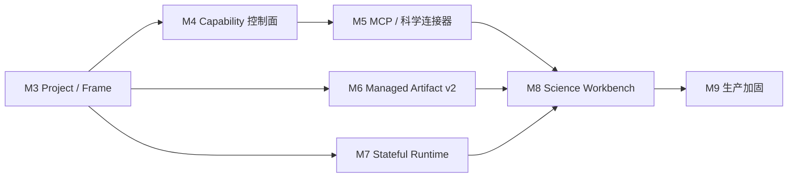

# Implementation Plan: OpenClaw Science Workbench Milestones

- 日期：2026-07-16
- 依赖基线：M0 BFF Bridge、M1 Single Chat、M2 Multi-session/Subagent/Skills/Artifact Delivery
- 涉及仓库：当前 `openclaw-integration`、`~/github/agent-server`、`~/github/agent-frontend`
- 目标：在现有 WebChat 上增加 Project/Frame、统一科学能力接入、受管 Artifact 和有状态科学执行环境
- 粗估：1 名熟悉三仓链路的工程师，33～47 个工作日；不含外部数据库采购、OAuth 审批和生产基础设施排期

## 1. 结论

建议从 M3 延续现有编号，按以下顺序推进：

| 里程碑 | 目标                        | 主要产出                                                               | 粗估   |
| ------ | --------------------------- | ---------------------------------------------------------------------- | ------ |
| M3     | Project / Frame 领域底座    | Project、Frame、Science Session、授权与上下文绑定                      | 4～6d  |
| M4     | 统一 Capability 控制面      | Skills、MCP、科学数据库、领域工具的统一目录与项目级启用策略            | 4～6d  |
| M5     | MCP 与科学连接器执行面      | MCP adapter、科学数据库/领域工具 adapter、健康检查与审计               | 5～7d  |
| M6     | Managed Artifact v2         | Artifact 逻辑身份、不可变版本、显式提升、基础血缘与项目级资产库        | 5～7d  |
| M7     | Stateful Science Runtime v1 | Project/Frame 级 Python kernel、执行账本、隔离、重置与中断             | 7～10d |
| M8     | Science Workbench 产品闭环  | Project/Frame/Session 导航、Chat、Artifact、Execution、Capability 面板 | 4～6d  |
| M9     | 可复现性与生产加固          | 环境快照、审计、配额、故障恢复、导出清单与安全门禁                     | 4～5d  |

依赖关系：



## 2. 当前实现基线

### 2.1 可直接复用

- M0：浏览器经 BFF 连接 OpenClaw Gateway；Principal、target、session、run ID 与事件隔离已经形成授权边界。
- M1：Chat history、实时 event、foreign run、断线对账、幂等探测和 assistant-ui 外部状态投影已经存在。
- M2：多 target、多 Session、子 Agent 只读活动、技能名称回显和 WebUI 文件交付已经存在。
- Skills：OpenClaw 已有 workspace/managed/bundled Skills 加载、`skills.status`、`skills.install` 和 per-agent filter。
- Plugin：OpenClaw `registerTool`、`registerGatewayMethod`、hook、service 和 manifest/schema 可作为 Science 扩展面。
- Artifact Delivery：`webui_artifact_publish` 已实现 workspace safe-open、hash、私有 OSS 直传、BFF 鉴权下载、session 配额和恢复列表。

### 2.2 需要升格

- 现有 WebUI Artifact 本质是“Session 文件交付”。它没有 Project/Frame、逻辑 Artifact 身份、版本父子、producer Run、输入依赖和环境快照。
- 现有 Session 列表以 target 为上层边界。它无法表达一个持续数周、包含多阶段、多会话和多产物的研究主题。
- 现有技能回显是 UI 派生值。它没有统一 Capability ID、项目级启用策略、健康状态和调用审计。

### 2.3 需要新增

- 通用 MCP runtime。当前 ACP translator 会忽略 `mcpServers`；`mcporter` 只用于 QMD memory bridge，无法承担统一科学工具接入。
- Project/Frame 领域模型和持久授权。
- Project/Frame 级有状态 Python 执行环境。
- Artifact 版本与基础 lineage。

### 2.4 开工闸门

三个工作树当前均有未提交的 M2 代码，且 OpenClaw 规划 worktree 落后远端 1 个 commit。进入 M3 前必须：

1. 为 M2 三仓代码建立可复现基线 commit/tag，记录测试结果和部署版本。
2. 保留现有 `/agent/chat` 与 M2 协议作为兼容路径，新 Science 能力使用独立 feature flag 和 `/agent/science` 路由。
3. 不在同步远端、整理 M2 改动和 M3 功能开发之间混写同一批 diff。

## 3. 领域边界

### Project

长期存在的研究主题和授权边界，保存：研究问题、描述、成员、默认 workspace root、默认 Capability 集、默认 Environment、Frame 列表和 Artifact 资产库。

### Frame

Project 内可分叉、可归档的工作上下文。一个 Frame 表示某个研究阶段、假设或分析分支，绑定：

- objective / context / constraints；
- 一组 Science Session；
- 启用的 Capability；
- 一个默认 Science Environment；
- 当前 Artifact 视图；
- parentFrameId，可用于 clone/fork，但不复制 Session transcript。

Frame 解决“大 Project 上下文无限增长”和“多个分析分支互相污染”的问题。

### Session / Run

- Session 继续承载对话 transcript 和实时事件。
- Run 表示一次 Agent 运行或一次科学执行。
- Project/Frame 不直接存聊天消息；它们只拥有 Session 引用、上下文和资源策略。

### Workspace File / Artifact

- Workspace File：工作过程文件，可覆盖、可删除，没有稳定交付语义。
- Artifact：通过显式 publish 提升的关键结果，拥有逻辑身份、不可变版本、内容 hash、来源和项目级可见性。
- 普通文件生成、stdout、tool partial 和临时图像不会自动成为 Artifact。

### Science Environment

Project/Frame 级执行环境定义。它记录 runtime image、Python 版本、依赖锁定摘要、资源限制和 kernel 生命周期策略。kernel 内存状态是运行态；Execution Ledger 和 Environment Snapshot 是持久态。

## 4. M3：Project / Frame 领域底座

### 目标

在 target 与 Session 之间增加 Project/Frame，使一个 Project 可以管理完整研究主题，同时保持 M2 Chat 链路兼容。

### 架构决策

1. PostgreSQL 中新增 `ScienceProject`、`ScienceFrame`、`ScienceSession`；agent-server 拥有领域数据和授权。
2. 浏览器使用 `projectId + frameId + clientSessionId`。BFF 将三者映射为单一内部 session segment，例如 `sci_<hash>`，继续生成现有五段式 Gateway key：

   ```text
   agent:{agentId}:webchat:{targetNamespace}:sci_<hash(projectId,frameId,sessionId)>
   ```

   这样可以继续复用 Gateway session、BFF 事件过滤和 `webui-artifacts` 的父 WebUI session 判断。

3. Science Session 列表由 agent-server DB 管理；Gateway `sessions.list` 只用于 transcript/状态对账，不再承担 Project/Frame 目录真相源。
4. 现有 `/agent/chat` 不要求 Project/Frame；`/agent/science` 强制二者存在。

### 主要改动

- `agent-server:app/core/entities/openclaw/science_projects.py`
- `agent-server:app/common/ports/repository/db/science_project_repository.py`
- `agent-server:app/infra/repository/db/pos/science_project_po.py`
- `agent-server:app/services/science_project_service.py`
- `agent-server:app/api/v1/controllers/science_project_controller.py`
- `agent-server:migrations/versions/<next>_add_science_projects_frames_sessions.py`
- `agent-server:app/services/openclaw_bridge_service.py`：扩展 binding、Project/Frame 授权和 session 映射。
- `agent-server:app/core/entities/openclaw/artifacts.py` 中的 `OpenClawSessionBinding`：增加可选 Project/Frame 字段，legacy Chat 保持为空。
- `agent-frontend:src/features/openclaw-science/`：Project/Frame API、route state 和薄页面骨架。

### 验收标准

- 用户可以新建 Project、Frame 和多个 Session。
- 同 Project 不同 Frame 的 transcript、实时事件和 Session 列表不串。
- URL 注入其他用户的 projectId/frameId 时 BFF default deny。
- Project/Frame 删除采用 archive；存在 Session、Artifact 或 Execution 时不做物理删除。
- M2 `/agent/chat` 全部回归通过。

## 5. M4：统一 Capability 控制面

### 目标

建立统一目录和策略模型，让 Skills、MCP Server、科学数据库和领域工具可以被发现、选择、授权和审计。

### 核心模型

```text
ScienceCapability
  id
  kind = skill | mcp_server | science_database | domain_tool
  name / description / version
  provider / transport
  risk = read | write | execute | network
  credentialRef
  health / lastCheckedAt
  toolDescriptors[]

FrameCapabilityBinding
  frameId / capabilityId
  enabled / policy / configOverrides
```

统一发生在“目录、策略、健康和审计”层。各能力继续使用适合自己的执行机制：Skill 走 OpenClaw 原生加载，MCP 走 MCP adapter，数据库/领域 SDK 走 connector adapter。

### 主要改动

- `openclaw-integration:extensions/science-connectors/`：manifest、schema、Capability registry、Gateway 只读目录方法。
- BFF 内部调用现有 `skills.status`，剥离绝对路径和安装细节后合并到 Science Capability DTO。
- `agent-server` 新增 capability catalog/binding repository 和服务；DB 只存 `credentialRef`，不存 raw secret。
- `agent-frontend:src/features/openclaw-science/capabilities/`：Project/Frame 级启用、状态和风险展示。
- `bridge.hello.features` 增加 `scienceProjects`、`scienceCapabilities` feature flag。

### 验收标准

- 同一个列表可以展示 Skill、MCP、数据库和领域工具，且保留 kind 区分。
- Frame 可以覆盖 Project 默认 Capability 集。
- Skill 状态来自 OpenClaw 当前 workspace/agent，不靠前端静态配置推断。
- 浏览器 DTO、日志和 tool event 不包含 secret、绝对 credential path 或 MCP auth header。
- 禁用 Capability 后，新 Run 无法调用；已开始的 Run 按既定 policy 完成或中止。

## 6. M5：MCP 与科学连接器执行面

### 目标

把 M4 目录中的能力接入 Agent runtime，并形成统一超时、输出限制、错误和调用审计。

### 执行链

```text
Frame Capability Policy
  -> extensions/science-connectors
  -> MCP adapter / REST adapter / SDK adapter
  -> normalized tool descriptor
  -> OpenClaw registerTool
  -> Agent tool call
  -> normalized result + capabilityId + connectorId + audit event
```

### 首版范围

- MCP：stdio + Streamable HTTP；支持 static bearer/API key secretRef。
- 暂不实现任意第三方 OAuth 动态授权。
- 科学数据库选择一个文献类和一个结构化数据库类作为真实样本；其余连接器按相同 adapter contract 扩展。
- 工具名使用稳定、合法的 provider 名称，例如 `science_<connector>_<tool>`；显示名称与底层 MCP tool name 分离。
- 工具分级：read、write、execute、network；默认只自动开放 read。

### 主要改动

- `openclaw-integration:extensions/science-connectors/src/mcp/`
- `openclaw-integration:extensions/science-connectors/src/adapters/`
- `openclaw-integration:extensions/science-connectors/src/policy/`
- `openclaw-integration:extensions/science-connectors/src/audit/`
- `agent-server` Capability health、credential resolution 和审计查询接口。
- `agent-frontend` ToolCallGroup 增加 capability/connector 展示，但继续隐藏原始 args、result 和 secret。

### 验收标准

- fake MCP server 覆盖 initialize、tools/list、tools/call、timeout、断开重连和非法 schema。
- 两个真实科学连接器完成最小 read-only smoke。
- 不同 Frame 的工具 allowlist 相互隔离。
- Connector 不可用时只禁用对应能力，Chat 与其他能力继续工作。
- 大结果使用摘要 + workspace file；禁止把数十 MB 结果直接塞入 Chat event。
- 每次调用可按 projectId/frameId/sessionId/runId/capabilityId 查询审计记录。

## 7. M6：Managed Artifact v2

### 目标

在现有文件交付链上增加项目级逻辑 Artifact、不可变版本和基础血缘；关键结果通过显式 publish 从 Workspace File 提升。

### 数据模型

```text
ScienceArtifact
  id / projectId / frameId / title / kind
  currentVersionId / lifecycle

ScienceArtifactVersion
  id / artifactId / version
  openclawArtifactId       # 复用 M2 OSS 文件行
  sha256 / size / contentType
  parentVersionId
  producerSessionId / producerRunId / sourceToolCallId
  environmentSnapshotId
  createdAt

ScienceArtifactDependency
  versionId / inputArtifactVersionId / relation
```

`openclaw_artifacts` 继续承担私有对象存储、上传状态、下载授权和 retention。新表提供逻辑身份与版本，不修改 M2 已有行的交付语义。

### 发布规则

1. Agent 或用户显式调用 `science_artifact_publish`。
2. BFF 从 session binding 得到 Project/Frame；浏览器和 tool 参数不能覆盖归属。
3. 复用 safe-open、hash、OSS PUT、HEAD 对账链。
4. 上传 ready 后，在同一服务事务中创建 logical artifact/version/dependency。
5. 普通 Workspace File、解释器 stdout、临时图像和中间 tool output保持普通运行结果。

### 主要改动

- `openclaw-integration:extensions/science-artifacts/`，或在 `webui-artifacts` 内增加兼容 adapter；旧工具继续服务 legacy Chat。
- `agent-server` 新增 ScienceArtifact root/version/dependency entity、repository、migration 和 service。
- Artifact API 改为 Project/Frame 目录、版本详情和 lineage 查询；download 继续短时签名。
- `agent-frontend:src/features/openclaw-science/artifacts/`：项目资产库、版本列表、来源 Run/Environment 展示。

### 验收标准

- 同一逻辑 Artifact 可发布 v1、v2，旧版本内容和 hash 保持不变。
- 相同 tool retry 幂等，不重复创建版本。
- Workspace 文件被覆盖后，已发布 Artifact Version 下载内容不变化。
- 能追踪 producer Session/Run/tool；缺少 runId 时明确标记 `producerRunUnknown`，不伪造。
- 普通文件不会自动出现在项目 Artifact 库。
- M2 session 文件卡和下载行为保持兼容。

## 8. M7：Stateful Science Runtime v1

### 目标

交付 Project/Frame 级 Python 有状态执行环境，让变量、imports 和工作目录可跨多次 Agent tool call 复用，同时持久记录每次执行。

### 运行模型

- 在 `agent-server` 仓库新增独立 `science_runtime` 应用和容器，不把 kernel 进程塞入 BFF WebSocket 进程。
- OpenClaw 扩展注册 `science_python_execute`、`science_kernel_status`、`science_kernel_interrupt`、`science_kernel_reset`。
- kernel key：`projectId + frameId + environmentId + language`；同一 key 串行执行。
- v1 仅 Python。R、SSH、Slurm、Modal 放入后续版本。
- kernel 使用受限容器/worker，设置 CPU、内存、wall time、workspace mount 和网络策略；禁止直接在 BFF 宿主进程 `exec` 用户代码。
- runtime 内存可因重启丢失；Execution Ledger、代码、输出摘要、文件变化和 Environment Snapshot 必须持久。

### 输出合同

```text
ScienceExecutionResult
  executionId
  kernelId / stateGeneration
  status
  stdout / stderr / result / error
  startedAt / endedAt
  filesCreated[] / filesModified[]
  environmentSnapshotId
```

- 文本字段设置上限；超限内容写入 workspace file。
- 允许白名单 MIME：text/plain、application/json、image/png 等；任意 HTML 默认作为下载文件处理。
- 输出文件只是 Artifact candidate，需要独立 publish。

### 主要改动

- `agent-server:science_runtime/`
- `agent-server:app/core/entities/openclaw/science_execution.py`
- `agent-server:app/services/science_execution_service.py`
- `agent-server:migrations/versions/<next>_add_science_environments_executions.py`
- `openclaw-integration:extensions/science-runtime/`
- `agent-frontend:src/features/openclaw-science/execution/`

### 验收标准

- 第一次执行 `x=41`，第二次执行 `x+1` 返回 42，且两次属于同一 Frame/kernel generation。
- 不同 Project/Frame 的变量、cwd 和文件视图不串。
- timeout、interrupt、reset 后状态迁移明确；reset 会增加 generation。
- runtime 崩溃后 UI 显示 kernel state lost，Execution Ledger 仍可读取；不声称恢复内存变量。
- 执行产生的文件不会自动成为 Artifact。
- 单 kernel 并发请求串行，取消不会误杀其他 Frame。

## 9. M8：Science Workbench 产品闭环

### 目标

把 M3～M7 组合成一个可完成真实研究任务的工作台。

### 页面结构

```text
左侧：Project -> Frame -> Session
中间：assistant-ui Chat + Tool/Subagent/Execution cards
右侧：Artifacts | Execution | Capabilities
顶部：当前 Frame objective、Environment、运行状态
```

### 主要改动

- 新路由：`/agent/science/:projectId/frame/:frameId/session/:sessionId`。
- `agent-frontend:src/features/openclaw-science/` 组合现有 OpenClaw Chat primitive，不复制 Chat reducer/WebSocket client。
- Frame create/clone/archive；clone 复制 context、Capability binding 和 Environment 选择，不复制 transcript/kernel 内存。
- Chat connect 时 BFF 返回 Project/Frame 摘要、Capability IDs 和 Environment 状态；前端不自行拼权限结论。
- Artifact/Execution live event 与 HTTP list 继续采用“事件改善即时性，DB/API 负责恢复”的模式。

### 端到端验收路径

1. 创建 Project 和 Frame。
2. 为 Frame 启用文献 Skill、一个 MCP 和一个科学数据库连接器。
3. 在多个 Session 中完成检索、分析和子 Agent 调研。
4. 在同一 Frame 的 Python kernel 中分两次执行分析。
5. 将结果文件显式发布为 Artifact v1，再修改工作文件并发布 v2。
6. 刷新浏览器后恢复 Project/Frame/Session、Artifact、Execution Ledger 和 Capability 选择。

## 10. M9：可复现性与生产加固

### 目标

使 Science 工作台具备企业私有化部署需要的可审计、可恢复和可控资源边界。

### 范围

- Environment Snapshot：image digest、Python version、依赖 lock hash、Capability version、关键配置摘要。
- Artifact lineage 完整性检查：producer、inputs、environment、hash 缺失时显示明确状态。
- connector credential 轮换、最小权限、调用速率限制和异常熔断。
- kernel lease、单副本约束解除、worker crash recovery、孤儿 kernel 清理。
- Project 级配额：Artifact 数量/容量、Execution 时间、并发 kernel、Connector 请求。
- Project export manifest：Project/Frame 元数据、Artifact 版本清单、Execution Ledger、Environment Snapshot；不导出 secret。
- 安全测试：路径逃逸、MCP schema 注入、恶意 tool name、跨 Project ID、超大输出、kernel 资源耗尽。

### 验收标准

- 任一 Artifact Version 可回答“由哪个 Project/Frame/Session/Run、使用哪个环境和输入产生”。
- Connector secret 不进入 browser、Gateway event、chat history、Artifact metadata 和普通日志。
- runtime worker 异常不会影响 BFF Chat；恢复后状态可对账。
- 跨 Project/Frame 的 Session、Artifact、Execution 和 Capability 访问全部 default deny。
- 定向安全、迁移、回滚和真实 Science smoke 通过。

## 11. 测试策略

### OpenClaw integration

- extension tests：Science connector、Artifact、Runtime 工具注册、context gating、secret 脱敏。
- gateway tests：只在新增 Gateway method/schema 时运行定向 Vitest；优先用 plugin Gateway method 减少 core 修改。
- fake MCP server 和 fake science runtime 作为确定性 fixture；真实外部数据库只做 opt-in live smoke。

### agent-server

- entity/repository/service/controller 分层单测。
- migration forward/backward 测试。
- Project/Frame/Session/Artifact/Execution 跨用户与跨 target 授权矩阵。
- Redis binding、DB transaction、artifact publish 幂等、kernel lease 和清理任务测试。

### agent-frontend

- 现有 Chat reducer、assistant-ui adapter 和 BFF client保持原测试。
- 新增 Project/Frame route、Capability selection、Artifact version、Execution state 的 mapper/hook/component 测试。
- 端到端覆盖刷新恢复、切换 Frame、运行中切 Session、Artifact v2 和 kernel reset。

## 12. 关键风险

| 风险                                                         | 处理                                                                         |
| ------------------------------------------------------------ | ---------------------------------------------------------------------------- |
| Project/Frame 直接扩展 Gateway session key，破坏现有五段解析 | BFF 映射为单一 opaque session segment；DB 保存逻辑关系                       |
| 统一接入被实现成统一执行协议，Skill/MCP/数据库语义丢失       | 只统一目录、策略、健康和审计；执行保留 adapter                               |
| Project 只是 UI 文件夹，无法影响 Agent 上下文和权限          | BFF binding、Capability policy、Environment、Artifact 都强制带 Project/Frame |
| 现有 Artifact 表直接改成逻辑 Artifact，M2 下载链回归         | 新增 logical root/version 表，复用现有 `openclaw_artifacts` 作为存储对象     |
| kernel 状态被误认为可恢复                                    | UI 和协议区分 memory state 与 Execution Ledger；重启时明确 state lost        |
| 有状态 Python 继承宿主权限                                   | 独立 runtime worker/container、资源与网络策略；BFF 不执行用户代码            |
| MCP server 返回超大或恶意内容                                | schema 校验、输出上限、超时、MIME/URI 清洗和审计                             |
| Frame clone 复制运行态导致隐式共享                           | clone 只复制配置；Session、Run、kernel memory 和 Artifact Version 不复制     |
| 三仓未提交 M2 与新功能混杂                                   | M3 前先固化三仓基线，再分别建常规 feature branch                             |

## 13. 首轮明确不做

- 可编辑 Jupyter Notebook 文档和完整 Jupyter MIME/widget 协议。
- R kernel、SSH、Slurm、Modal 和多机调度。
- 独立科学 Reviewer 门禁。
- Workspace 文件自动提升 Artifact。
- 任意 MCP OAuth 动态授权和用户自助安装未知 MCP server。
- 跨 Project 的公共 Artifact 市场。
- kernel 内存 checkpoint 的透明恢复。

这些能力在 M9 稳定后按独立里程碑规划。

## 14. 总体验收标准

- [ ] Project 可以管理多个 Frame，每个 Frame 可以管理多个 Session。
- [ ] Frame 绑定自己的 Capability 集、Environment 和 Artifact 视图。
- [ ] Skills、MCP、科学数据库和领域工具在统一目录中可发现、可授权、可观测。
- [ ] MCP/connector 调用不会跨 Frame 越权，secret 不进入浏览器或 Chat 历史。
- [ ] Workspace File 只有经过显式 publish 才进入 Project Artifact 库。
- [ ] Artifact 支持不可变版本、producer 和基础 input/environment lineage。
- [ ] 同一 Frame 的 Python 状态可跨多次 tool call 复用；不同 Frame 状态隔离。
- [ ] kernel 内存丢失与持久 Execution Ledger 在 UI/协议中明确区分。
- [ ] 刷新后恢复 Project/Frame/Session、Artifact、Execution Ledger 和 Capability 配置。
- [ ] M0/M1/M2 Chat、Subagent、Skill display 和 legacy Artifact Delivery 回归通过。
